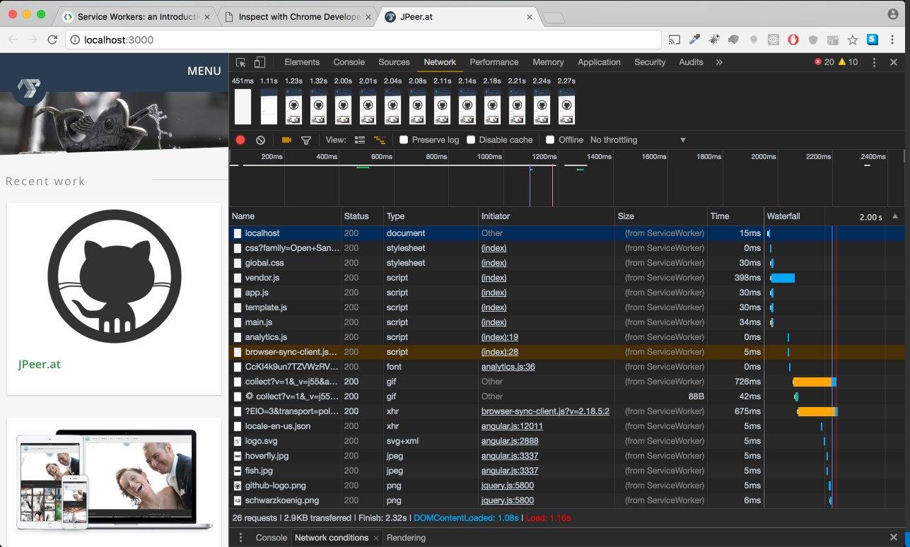

# Service Worker

> simple implementation of service workers

## Usage
```sh
$ npm i -g gulp-cli
$ npm i -g bower
$ yarn
$ gulp serve
```

Service worker ist in `src/assets/js/app.js` ganz unten definiert.

`sw.js` ist in `src/sw.js`

## Ohne Serviceworker

Ohne service worker muss er das ganze neu vom server holen, er cacht selbst, fast gar nichts.


## Mit Serviceworker



Warum das finish im endeffekt länger dauert weiß ich nicht genau,
ich habe aber eine vermutung, da ich die applikation ja auch offline laufen lassen kann,
und die applikation dann immer wieder requests zu einer datei namens browser-sync-client.js macht.
und das versucht eine veränderung zu erkennen, ich glaube um das echte ergebnis zu sehen müsste die seite in production sein. Offline dauert das finnish unendlich da immer wieder request gesendet werden die nich möglich sind.

Die seite ist aber offline komplett benutzbar. Das heißt wenn man den task `gulp serve` abbricht und dann auf `localhost:3000` navigiert kann man die seite trotzdem noch benutzen.

Um die seite mit Service workern zu testen muss man einfach `gulp serve` nutzen.

Möchte man die service worker deactivieren muss man in den chrome devtools den tab `application` suchen und dort bei service worker auf unregister drücken. Muss man in der datei `src/assets/js/app.js` den service worker teil auskommentieren, ansonsten würde der service worker bei jedem neuen request aktiviert werden.

in den Chache kommmt die index.html und alle damit verbundenen scripts und stylesheets.

```js
var urlsToCache = [
 '/index.html',
 '/favicon.ico',
 '/assets/css/global.css',
 '/assets/js/vendor.js',
 '/assets/js/app.js',
 '/assets/js/template.js',
 '/assets/js/main.js'
];
```

das sw.js script kommt vollständig von `https://developers.google.com/web/fundamentals/getting-started/primers/service-workers`
mit adaptionen an die hier vorgegebene file struktur.

Alle test in Chrome v58.0.3029.110 durchgeführt
|     | Finnish ohne sw  | DOM ohne sw   | Load ohne sw  | Finish mit sw   | DOM mit sw   | Load mit sw   |
|:----|:----------------:|:-------------:|:-------------:|:---------------:|:------------:|:-------------:|
| 1   | 1.79s | 1.36s | 1.44s | 2.29s | 1.08s | 1.17s |
| 2   | 1.68s | 1.26s | 1.34s | 2.51s | 1.26s | 1.44s |
| 3   | 1.85s | 1.36s | 1.44s | 2.24s | 1.17s | 1.27s |
| 4   | 2.01s | 1.52s | 1.60s | 2.49s | 1.20s | 1.44s |
| 5   | 1.65s | 1.16s | 1.32s | 2.32s | 1.08s | 1.16s |

|  Ø   | Finnish ohne sw  | DOM ohne sw   | Load ohne sw  | Finish mit sw   | DOM mit sw   | Load mit sw   |
|:-----|:----------------:|:-------------:|:-------------:|:---------------:|:------------:|:-------------:|
|      |      1.796s      |    1.332s     |     1.428s    |      2.370s     |    1.158s    |     1.296s    |

